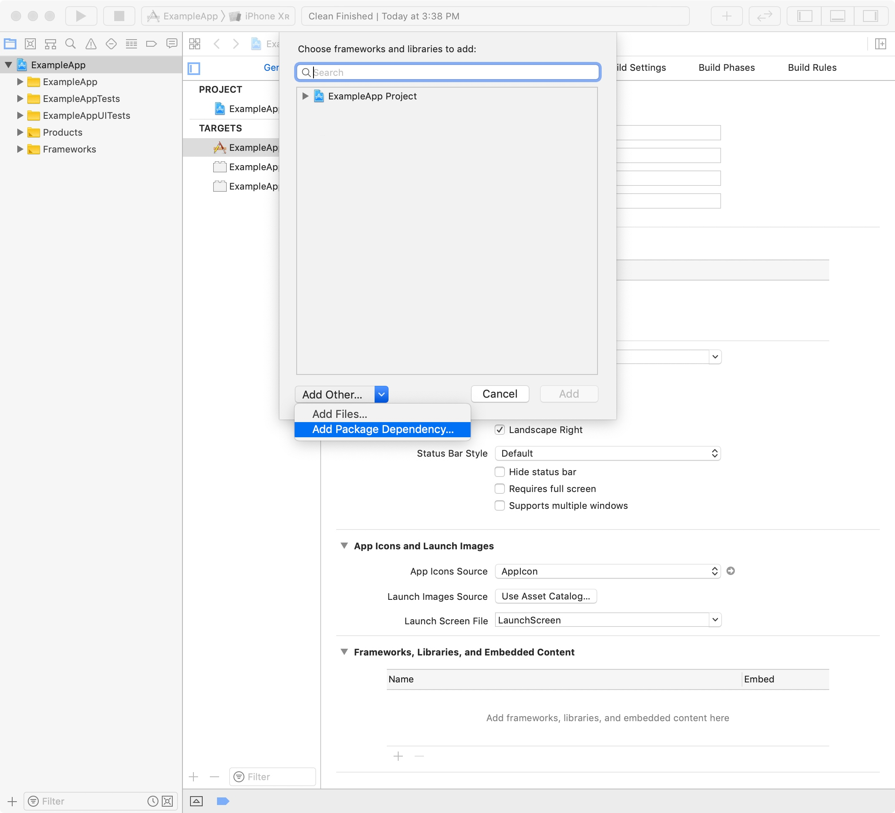
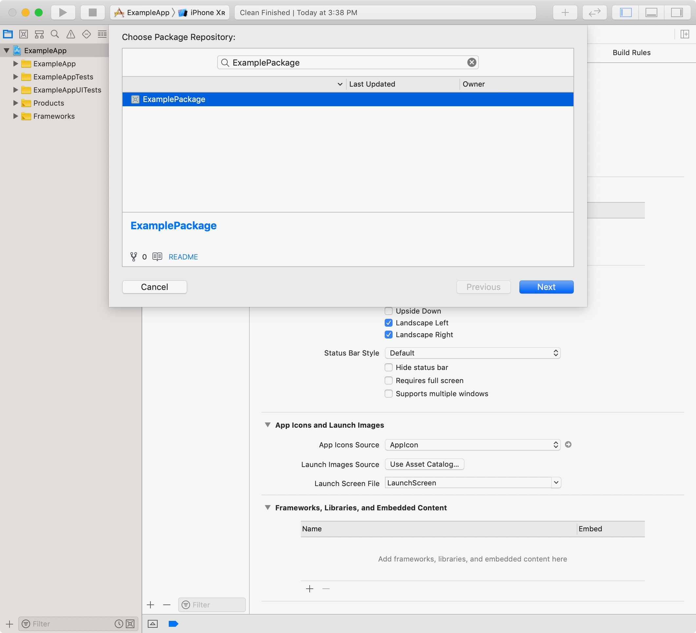

通过集成 package 依赖，实现项目之间共享代码，或利用其他开发者的代码。

## 概述

Xcode 内置了对源控制账户的支持，并能轻松利用可用的 Swift 包。使用 Xcode 来管理包的依赖版本，并确保你的项目有最新的代码变化。

::: tip
**Note**

Package 作者可以将他们的 Swift Package 发布到公共或私人仓库。Xcode 支持私有和公开的软件包。
::: tip

## 添加 Package 依赖

要在你的 Xcode 项目中添加一个 Package，选择`File> Add Packages`，并输入其存储库的 URL。你也可以导航到你的目标的常规窗格，在 "Frameworks, Libraries, and Embedded Content"部分，点击 + 按钮，选择`Add Other`，并选择`Add Package Dependency`。

你可以在 GitHub 或 GitHub Enterprise 上搜索一个软件包，而不是添加一个仓库的 URL。在 Xcode 的 preferences 添加你的 GitHub 或 GitHub Enterprise 账户，当你输入时，就会出现一个软件包库的列表。下面的截图显示了一个用户在 Xcode 的 preferences 中添加了他们的 Git 提供者的搜索词 ExamplePackage 的存储库列表。

* 你的 Git 存储库
* 你的团队的 Git 仓库
* 你在 GitHub、GitHub Enterprise、GitLab 星级仓库

